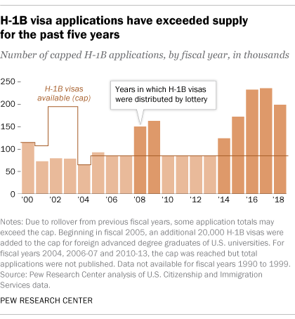
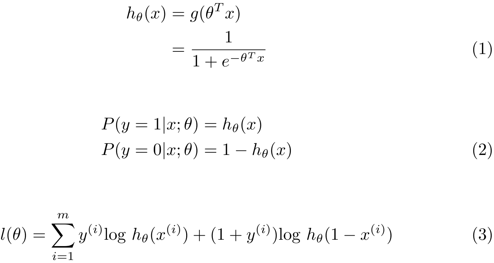
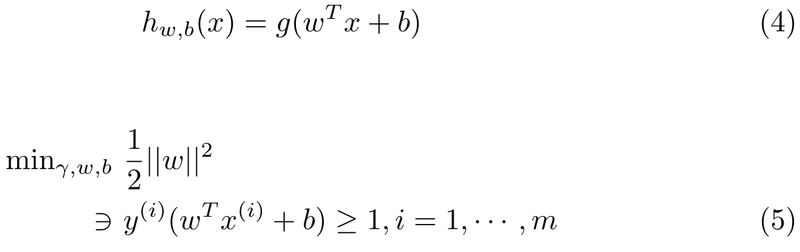
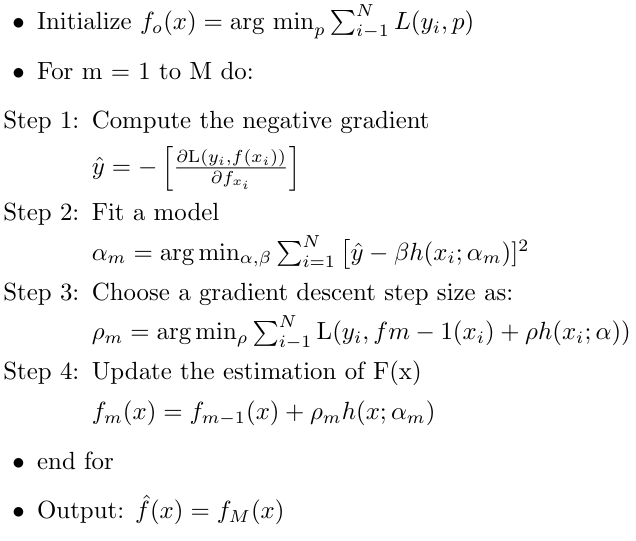
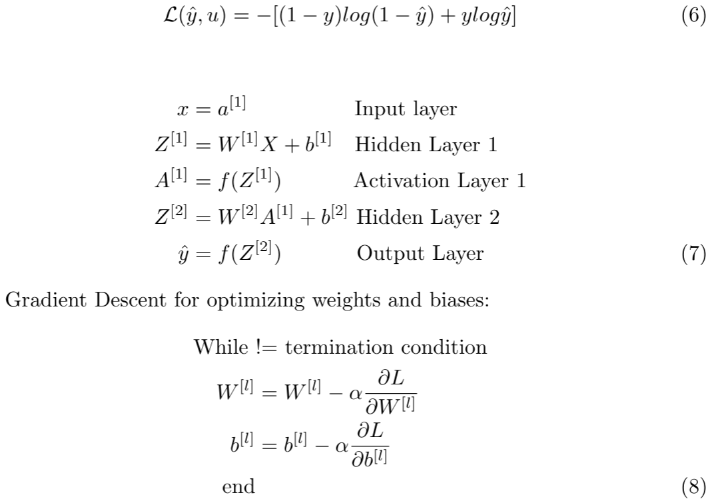
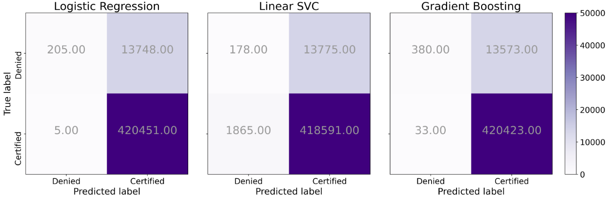
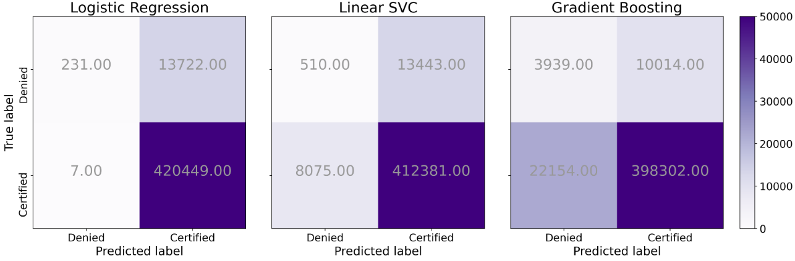
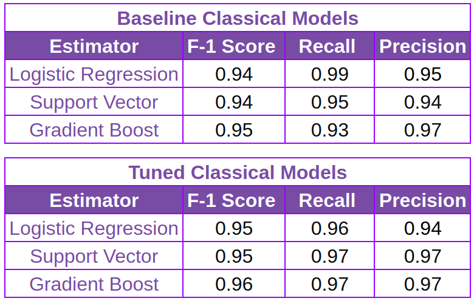
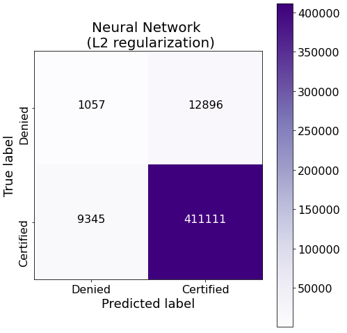
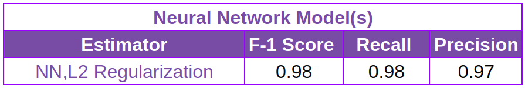

# Predicting H-1B Visa Petition Outcomes
* **Author:** Prasoon Karmacharya
* **Email:** [prasoon.karma@gmail.com](mailto:prasoon.karma@gmail.com)
* **LinkedIn:** [in\karmacharya](https://linkedin.com/in/karmacharya)

## Problem Statement
> Can we build a machine learning model to predict the outcome of the H-1B Visa Petition?

## Background

The H-1B visa is a non-immigrant visa that permits companies in the United States to employ foreign workers in specialty occupations that require specialized knowledge and a bachelor’s degree or higher in the specific specialty. The US Immigrant Service has been granting 85,000 H-1B visas annually since 2004[1]. The demand for H-1B workers has shown an upward trend in recent years. The unclear selection process surrounding the H-1B visa petition has left many employers and employees wondering if it is a worthy investment to hire foreign employers.

In this project, I engineered a predictive model to determine the outcome of the H-1B visa petition with the F1-score, recall, and precision of 0.98, 0.98, and 0.97, respectively. Such a model could be a useful resource for future visa applicants as well as the employer who are sponsoring them.

## Methodology
Data Acquisition and Processing
I obtained a [dataset](https://www.kaggle.com/nsharan/h-1b-visa) from Kaggle  containing 3 million records of past H-1B Visa Petition applications between 2011 and 2016. The dataset consists of 7 features along with the outcome of the petition as the label. After performing some exploratory data analysis, a few of these feature columns were preprocessed in preparation for modeling.

After pre-processing the raw data, the data were divided into 60% development, 20 % validation, and 20% testing sets. All the models were trained using a development set and cross-validated using a validation set. The test set was used to assess the effectiveness of the model. Due to the inherent bias present in the dataset due to imbalance class between “CERTIFIED” and “DENIED” labels, the data were downsampled from the majority class for the development set.

### Modeling
To train the models, I used three classical models, namely Logistic Regression, Support Vector Classifier, and Gradient Boost Classifier. Besides, I also experimented with a Neural Network architecture. A summary of each of the classifier is presented below:

#### Logistic Regression
Logistic regression uses the sigmoid function as its hypothesis as given by equation (1), The key assumption behind logistic regression for binary classification problem is illustrated using equation (2). When training the model, logistic regression attempts to find theta parameter that maximizes the log-likelihood of the data as given by equation (3). Logistic regression thus gives a conditional distribution of response Y given predictor variables represented in matrix x. Furthermore, Logistic regression can be thought of as a generalized linear model in which the link function given by equation (3) relates the response variable Y to the linear model.

#### Support Vector Classifier
The objective of the Support Vector Classifier is to find a hyperplane that separates two different classes using non-linear boundaries such that the distance from the data points closest to the hyperplane is maximized. The optimization criteria for this class of model architecture can be summarized using equation (4) which is the hypothesis function and optimization function which happens to be a convex quadratic function with linear constraints given by equation (5). The solution to this objective function gives us the optimal margin classifier which nicely fits our problem space and is solvable using quadratic programming. More specifically, I used a quadratic programming implementation from libsvm that is utilized by scikit-learn’s SVC solver.

#### Gradient Boost Classifier
As the name suggests, gradient boosting is an ensemble boosting technique in which predictions are made from a collection of individual so-called, “weak learners”. The individual models are iteratively trained on a subset of the training set and gradient descent is used to minimize a loss function sequentially. This allows the model to learn from past mistakes and help improve the generalizability of the model. Following is the general gradient boost algorithm:

#### Neural Network
Neural Network architectures are a non-linear machine learning technique that utilizes multi-layer structures consisting of building blocks called “neurons”. Each neuron in the architecture introduces non-linearity with a chosen activation function g(x) for a weighted input before it propagates the learned information to the next layer. In this case, I used sigmoid as my activation function. The objective of NN is to minimize the cost function given by equation (6) for the prediction made by the output layer. One such simple forward propagating NN with an input layer, two hidden layers, and an output layer can be represented using a set of equations (7). For different layers (l) in the architecture, the parameters, W and b, are updated using a gradient descent algorithm given by equation (8). This process of updating the weights and biases is commonly referred to as backpropagation.

## Evaluation Metric
Since the objective of the model is to correctly predict the outcome of the H-1B visa petition a high true positive rate and low false negative is desired in our prediction. To that effect, recall, commonly known as a sensitivity, which measures the true positive rate and precision which minimizes the false negative, are suitable evaluation metrics. In order to capture both recall and precision in a single metric, the F1 score, a harmonic mean of said metrics, is utilized to optimize my models. A high F1 score indicates that the model has high recall and high precision. It is important to note that accuracy as an evaluation metric when dealing with high-class imbalance can be miss-leading due to inherent bias in the dataset. 

Furthermore, since the dataset contains high class-imbalance characteristics, the average prediction outcome cannot be used as a baseline metric. As such, I used vanilla Logistic Regression without regularization as my baseline model, with a 0.94 F1 score. The success of my model was evaluated based on whether they can outperform the baseline model.

|          Confusion matrix Baseline Classical Model          |              Confusion matrix Tuned Classical Model          |     
| :---------------------------------------------------------: | :-----------------------------------------------------------:| 
|  |    | 

## Results
 
The preliminary baseline result of the classical models is presented in the table and the confusion matrix above. Although the recall and F1 scores are high, due to the class imbalance, these classical models are ineffective at correctly detecting denied instances which are the minority class in the data-set. After tuning the models and minimizing the class imbalance by undersampling the majority class (75:25) from (99:1), the marginal performance improvement was obtained. Among the classical models, the ensemble gradient boost model was the best performing model with an F1 score of 0.96 which is better than the baseline model by 2%. As shown in the summary table, the performance of all the classical models was fairly comparable. Upon exhausting classical techniques to finetune the model, Neural Network was explored to improve predictive performance. The neural network model, with two hidden layers, relu as activation function, and l2 regularization outperformed all the classical models with an F1 score of 0.98. The superior performance of the neural network in comparison to classical models could be attributed to NN’s ability to learn and explain the complexities in the data.

## Conclusion
In this project, it was determined that it is possible to predict the outcome of an H-1B visa petition based on the attributes of the applicant using machine learning with fairly high recall and precision. With a 0.98 F1 score with the corresponding recall and precision of 0.98 and 0.97, respectively, the neural network architecture showed the best performance. Although the model has a high F1 score, there is still some room for improvement, it will be important to integrate more useful predictors that can further improve the performance and increase the confidence of the prediction. Comparable results from the classical models and neural network models suggest that such classical models may remove the need for fancier neural network architecture if we invest in a robust dataset with better predictive features.

## Future Recommendation
* Revisit this problem with a more robust data set with additional predictors (example: educational background, years of experience)
* Integrate data from more recent years (2017-2019) (work-in-progress)
* Create an interactive app that will allow future applicants to predict their outcome using the information they provide in an H-1B visa application.

## References
1. [Pew research report on H-1B visa program](https://www.pewresearch.org/fact-tank/2017/04/27/key-facts-about-the-u-s-h-1b-visa-program/)
2. [Data set](https://www.kaggle.com/nsharan/h-1b-visa)
